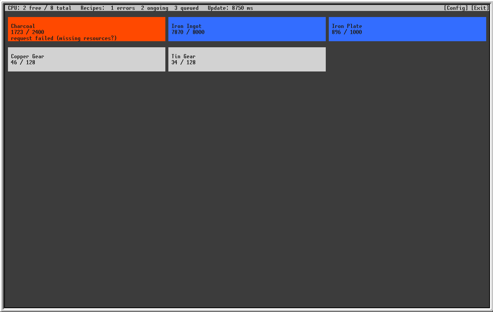
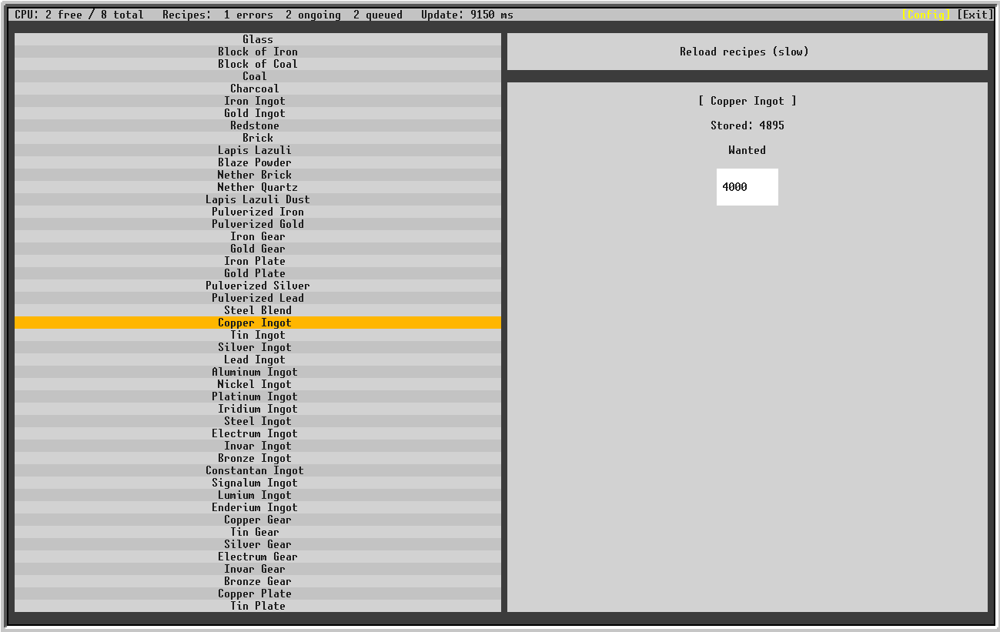

# Applied Energistics inventory manager for OpenComputers

Tested on 1.12, may work on older versions, but probably not after the 1.13 _flattening_.

**Disclaimer**: This is a very new project, expect crashes and bugs.

# Features

- Automatic item refill using the AE autocrafting system
- Queue status GUI
- Configurable from the GUI ! Install it once and never open the shell again !




# Installation

This program requires [IgorTimofeev's GUI library](https://github.com/IgorTimofeev/GUI/blob/043b5948fafd28aa90da1a3814cb0631b7caf227/README.md#installation), follow the
instructions on the repo, and then download this program:

```
wget -f https://raw.githubusercontent.com/KaseiFR/ae2-manager/master/src/ae2-manager.lua
```

The GUI is quite memory hungry, so don't forget to install 2 memory sticks matching your screen/GPU tier.

# License

MIT
